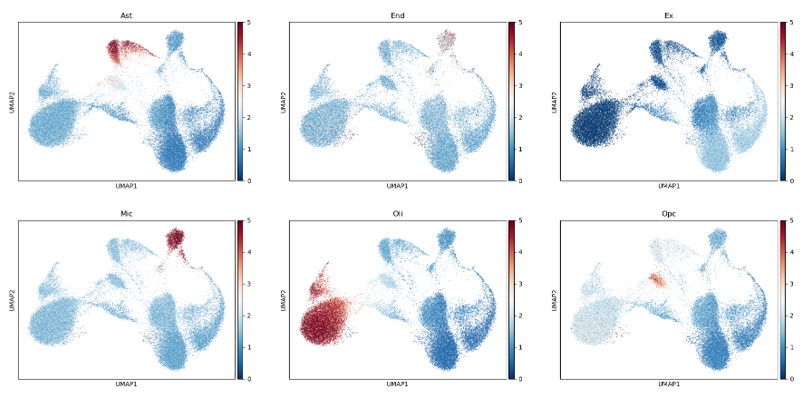

# Cell-type annotation with scATAC 

## A reference based cell type annotation tool for single cell ATAC-seq data

### tl;dr:  generate this figure for ATAC-seq data in a few minutes



## This repo includes

Efficient implementation of an cell type annotation method
* :zap: support multi-core processing
* :zap: support spare matrix to save memory
* :zap: pure python

Collection of cell type specific open chromatin regions to use

Tutorials

- [PBMC](./case_study/pbmc_5k_10x)
- [Brain](./case_study/brain_atac)

Command line usage

- usage: 

  cli_run.py [-h] [-o OUTPUT] [-t THRESHOLD] [--cpu CPU] [--verbose] [--umap_fig] [-u UMAP_INPUT] [-f OUTPUT_FIG]
                    count_input ref_folder

  positional arguments:
    * count_input           path to 10x input folder
    * ref_folder            path to a folder of cell type specific peaks

  optional arguments:
    * -h, --help            show this help message and exit
    * -o OUTPUT, --output OUTPUT
                          name of the output file
    * -t THRESHOLD, --threshold THRESHOLD
                          threshold to compute bed overlap. a float number ranges from 0 - 1.
    * --cpu CPU             number of cpus
    * --verbose             flag to print messages
    * --umap_fig            flag to skip ploting umap
    * -u UMAP_INPUT, --umap_input UMAP_INPUT
                          path to a csv file of umap coordinates (cell x 2). The file should have an index column of cell barcodes
    * -f OUTPUT_FIG, --output_fig OUTPUT_FIG
                          name of the output png figure

- Example:

  - To generate the cover figure, run

    ```bash
    python src/cli_run.py case_study/brain_atac/filtered_peak_bc_matrix/ OCR_DB/dev/GSE129785/ --cpu 10
    ```

    A file (score.csv) and png figure (score.png) will be outputted.
